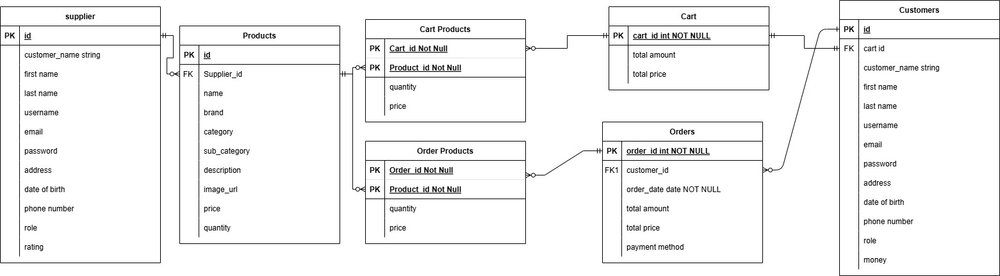
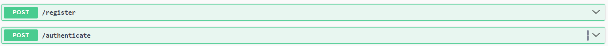
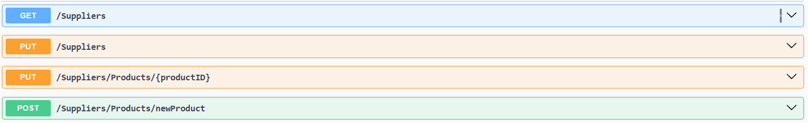
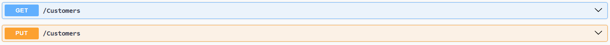
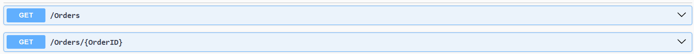
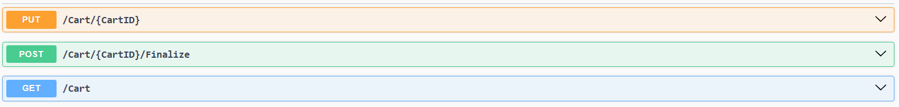
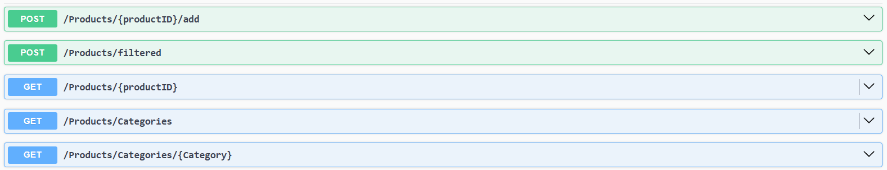

# E-Commerce API

> A robust backend server for an online shopping platform, built with industry best practices and secure authentication to ensure a seamless experience for customers and suppliers.

## Database Schema 


## 📌 Description

This project is a backend server for an online shopping platform, designed to simplify the shopping process for customers and streamline stock management for suppliers. It provides secure user authentication and authorization, ensuring that both customers and suppliers have a safe and personalized experience.

The platform supports essential e-commerce functionalities such as product browsing, order placement, and inventory control, all handled through a RESTful API.

I developed this project as a practical implementation of my backend development studies, utilizing the Spring Boot framework. The goal was to apply industry best practices in building scalable, maintainable, and secure backend services.

##  Technical Stack

- Java 23
- Spring Boot 3.4.2
- SpringDoc OpenAPI 2.8.6
- Lombok 1.18.36
- JWT Authentication 0.12.6
- PostgreSQL

## 🚀 Features

- Secure JWT-based authentication
- Swagger/OpenAPI documentation
- Role-based access control
- Product management for suppliers
- Add and edit items in the cart
- View order history

## 📷 Endpoints Documentation
### Auth Controller
```http
POST   /register         # User registration and JWT token generation  
POST   /authenticate     # User authentication and JWT token generation
```

### Supplier Controller
```http
   GET    /suppliers                            # Get info about the currently logged-in supplier  
   PUT    /supplier                             # Edit supplier information  
   PUT    /supplier/products/{productID}        # Edit a product's details  
   POST   /supplier/products/{productID}        # Add a new product
```

### Customer Controller
```http
    GET    /customers                # Get info about the currently logged-in customer  
    PUT    /customers                # Edit customer information
```

### Order Controller
```http
    GET    /orders                  # Get all past orders by the customer  
    GET    /orders/{orderID}        # Get details about a specific order
```


### Cart Controller
```http
    GET    /cart                                # View items in the customer's cart  
    PUT    /cart/{cartID}                       # Edit items in the cart  
    POST   /cart/{cartID}/finalize              # Finalize purchase and create order
```


### Product Controller
```http
    GET    /products/{productID}                      # Get product details  
    GET    /products/categories                       # List all product categories  
    GET    /products/categories/{category}            # List products in a category  
    POST   /products/{productID}/add                  # Add product to customer's cart  
    POST   /products/filtered                         # Get products matching filter
```


